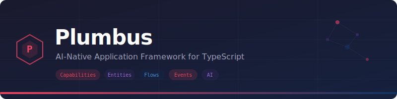

<p align="center">
  
</p>

<h1 align="center">Plumbus</h1>

<p align="center">
  <strong>AI-native, contract-driven TypeScript application framework</strong>
</p>

<p align="center">
  <a href="#quick-start">Quick Start</a> •
  <a href="#core-concepts">Core Concepts</a> •
  <a href="#project-structure">Project Structure</a> •
  <a href="#cli-reference">CLI</a> •
  <a href="#ai-agent-integration">Agent Integration</a> •
  <a href="docs/README.md">Full Documentation</a>
</p>

---

## What is Plumbus?

Plumbus is a **contract-driven, AI-native TypeScript framework** for building modern applications that are safe, auditable, and explainable by default.

Instead of writing loosely organized code, you define your system using five composable primitives:

| Primitive | Purpose | Defined with |
|-----------|---------|--------------|
| **Entity** | Data models with classification and retention | `defineEntity()` |
| **Capability** | Discrete business operations (query, action, job, eventHandler) | `defineCapability()` |
| **Flow** | Multi-step workflows orchestrating capabilities | `defineFlow()` |
| **Event** | Domain facts emitted by capabilities | `defineEvent()` |
| **Prompt** | Structured AI interactions with typed I/O | `definePrompt()` |

The framework provides:

- **Deny-by-default security** — every capability declares an access policy
- **Advisory governance** — warnings (not blockers) for risky patterns
- **Built-in audit trails** — automatic structured logging of all operations
- **Managed AI integration** — cost tracking, output validation, RAG pipelines
- **Compliance profiles** — GDPR, PCI-DSS, SOC2, HIPAA policy assessment
- **Full code generation** — typed API clients, React hooks, Next.js scaffolds

---

## Quick Start

### Prerequisites

- **Node.js** ≥ 20
- **pnpm** ≥ 10
- **PostgreSQL** (for persistence)
- **Redis** (for queues, optional)

### Create a New Application

```bash
# Install the CLI globally
pnpm add -g plumbus-core

# Scaffold a new project
plumbus create my-app --auth jwt --ai openai --compliance GDPR

# Navigate into your project
cd my-app

# Check environment readiness
plumbus doctor

# Start development server
plumbus dev
```

### Install in an Existing Project

```bash
pnpm add plumbus-core zod
pnpm add -D typescript vitest @types/node
```

---

## Core Concepts

### Capabilities

Capabilities are the **atomic units of business logic**. Every HTTP route, background job, and event handler is a capability:

```typescript
import { defineCapability } from "plumbus-core";
import { z } from "zod";

export const getUser = defineCapability({
  name: "getUser",
  kind: "query",
  domain: "users",
  description: "Retrieve a user by ID",
  input: z.object({ userId: z.string().uuid() }),
  output: z.object({ id: z.string(), name: z.string(), email: z.string() }),
  access: { roles: ["admin", "user"], scopes: ["users:read"] },
  effects: { reads: ["User"] },
  handler: async (ctx, input) => {
    const user = await ctx.data.User.findById(input.userId);
    if (!user) throw ctx.errors.notFound("User not found");
    return user;
  },
});
```

### Entities

Entities define your data models with field-level classification:

```typescript
import { defineEntity, field } from "plumbus-core";

export const User = defineEntity({
  name: "User",
  description: "Application user",
  tenantScoped: true,
  fields: {
    id: field.id(),
    name: field.string({ classification: "personal" }),
    email: field.string({ classification: "personal", maskedInLogs: true }),
    role: field.enum({ values: ["admin", "user", "guest"] }),
    createdAt: field.timestamp({ defaultNow: true }),
  },
});
```

### Flows

Flows orchestrate capabilities into multi-step workflows:

```typescript
import { defineFlow } from "plumbus-core";

export const refundApproval = defineFlow({
  name: "refundApproval",
  domain: "billing",
  trigger: { type: "event", event: "refund.requested" },
  steps: [
    { name: "validate", capability: "validateRefund" },
    {
      name: "decide",
      type: "conditional",
      condition: "ctx.state.amount > 100",
      ifTrue: "managerApproval",
      ifFalse: "autoApprove",
    },
    { name: "managerApproval", capability: "requestManagerApproval" },
    { name: "autoApprove", capability: "approveRefund" },
    { name: "notify", capability: "sendRefundNotification" },
  ],
  retry: { maxAttempts: 3, backoff: "exponential" },
});
```

### Events

Events represent domain facts:

```typescript
import { defineEvent } from "plumbus-core";
import { z } from "zod";

export const orderPlaced = defineEvent({
  name: "order.placed",
  schema: z.object({ orderId: z.string(), customerId: z.string(), total: z.number() }),
  description: "Emitted when a new order is successfully placed",
});
```

### Prompts

Prompts provide structured AI interactions:

```typescript
import { definePrompt } from "plumbus-core";
import { z } from "zod";

export const classifyTicket = definePrompt({
  name: "classifyTicket",
  model: "gpt-4o-mini",
  input: z.object({ ticketText: z.string() }),
  output: z.object({
    category: z.enum(["billing", "technical", "general"]),
    priority: z.enum(["low", "medium", "high"]),
    sentiment: z.enum(["positive", "neutral", "negative"]),
  }),
  systemPrompt: "You are a support ticket classifier. Analyze the ticket and return structured JSON.",
});
```

### Execution Context

Every capability handler receives `ctx` — the scoped runtime context:

```
ctx.auth       → Authenticated identity (userId, roles, scopes, tenantId)
ctx.data       → Entity repositories (ctx.data.User.findById(id))
ctx.events     → Event emission (ctx.events.emit("order.placed", payload))
ctx.flows      → Flow orchestration (ctx.flows.start("processRefund", input))
ctx.ai         → AI operations (generate, extract, classify, retrieve)
ctx.audit      → Audit logging (ctx.audit.record("user.updated", meta))
ctx.security   → Security helpers (hasRole, hasScope, requireRole, requireScope)
ctx.errors     → Structured errors (validation, notFound, forbidden, conflict)
ctx.logger     → Structured logging (info, warn, error)
ctx.time       → Time utilities (ctx.time.now())
ctx.config     → Read-only application configuration
```

---

## Project Structure

```
my-app/
├── app/
│   ├── capabilities/        # Business logic (defineCapability)
│   │   └── billing/
│   │       └── approve-refund/
│   │           ├── capability.ts
│   │           ├── impl.ts
│   │           └── tests/
│   ├── entities/            # Data models (defineEntity)
│   │   └── user.entity.ts
│   ├── flows/               # Workflows (defineFlow)
│   │   └── billing/
│   │       └── refund-approval/
│   │           └── flow.ts
│   ├── events/              # Domain events (defineEvent)
│   │   └── order-placed.event.ts
│   └── prompts/             # AI prompts (definePrompt)
│       └── classify-ticket.prompt.ts
├── config/
│   ├── app.config.ts        # Framework configuration
│   └── ai.config.ts         # AI provider configuration
├── .plumbus/
│   └── generated/           # Auto-generated (do not edit)
├── .github/
│   └── copilot-instructions.md  # GitHub Copilot wiring
├── AGENTS.md                # Agent context file
└── package.json
```

---

## CLI Reference

```bash
plumbus create <app-name>       # Scaffold a new project
plumbus dev                     # Start development server with hot reload
plumbus doctor                  # Check environment readiness (Node, DB, Redis)
plumbus generate                # Regenerate all artifacts from contracts
plumbus verify                  # Run governance rules
plumbus certify <profile>       # Run compliance profile assessment
plumbus migrate generate        # Generate database migration
plumbus migrate apply           # Apply pending migrations
plumbus rag ingest <path>       # Ingest documents into RAG pipeline
plumbus init                    # Generate AI agent wiring files
plumbus agent sync              # Sync project brief for coding agents
```

### `plumbus create`

```bash
plumbus create my-app \
  --database postgresql \
  --auth jwt \
  --ai openai \
  --compliance "GDPR,PCI-DSS" \
  --git                         # Initialize git repo (opt-in)
```

### `plumbus init`

Generates configuration files that help AI coding agents understand your project:

```bash
plumbus init --agent copilot    # GitHub Copilot instructions
plumbus init --agent cursor     # Cursor rules
plumbus init --agent agents-md  # AGENTS.md
plumbus init --agent all        # All formats (default)
```

---

## AI Agent Integration

Plumbus is designed to work seamlessly with AI coding agents (GitHub Copilot, Cursor, Cline, Windsurf, etc.).

### How Agents Discover Framework Knowledge

The framework ships with comprehensive instruction files inside the `plumbus-core` package:

```
node_modules/plumbus-core/instructions/
├── framework.md      # Core abstractions, execution context, project structure
├── capabilities.md   # Capability definitions, handlers, effects, access policies
├── entities.md       # Entity fields, classifications, relations, repositories
├── events.md         # Event emission, outbox pattern, consumers, idempotency
├── flows.md          # Workflow steps, triggers, retry, state management
├── ai.md             # AI prompts, generation, RAG, cost tracking, security
├── security.md       # Access policies, auth, tenant isolation, field classification
├── governance.md     # Advisory rules, compliance profiles, policy assessment
├── testing.md        # Test utilities (runCapability, simulateFlow, mockAI)
└── patterns.md       # Naming conventions, best practices, common patterns
```

The `@plumbus/ui` package also ships instructions:

```
node_modules/@plumbus/ui/instructions/
├── framework.md         # UI package overview, exports, concepts
├── client-generator.md  # Typed fetch clients, React hooks, flow triggers
├── auth-generator.md    # Auth types, token utils, hooks, route guard
├── form-generator.md    # Zod schema → form field metadata extraction
├── nextjs-template.md   # Full Next.js project scaffold
├── patterns.md          # UI conventions, do's/don'ts, workflows
└── testing.md           # UI test setup, strategy, patterns
```

### Wiring Agents to Your Project

```bash
# Generate all agent configuration files
plumbus init --agent all

# This creates:
# .github/copilot-instructions.md  — Points Copilot to framework docs
# .cursor/rules/plumbus.mdc        — Cursor rules with SDK references
# AGENTS.md                        — Universal agent context
# .plumbus/briefs/project.md       — Project-specific brief
```

### Manual Agent Setup

If you're configuring an agent manually, point it to the instruction files:

```markdown
# In your agent instructions:
When working with Plumbus, read these files for SDK reference:
- node_modules/plumbus-core/instructions/framework.md
- node_modules/plumbus-core/instructions/capabilities.md
- node_modules/plumbus-core/instructions/entities.md
- node_modules/plumbus-core/instructions/flows.md
- node_modules/plumbus-core/instructions/events.md
- node_modules/plumbus-core/instructions/ai.md
- node_modules/plumbus-core/instructions/security.md
- node_modules/plumbus-core/instructions/testing.md
```

---

## Packages

| Package | Description |
|---------|-------------|
| [`plumbus-core`](packages/plumbus-core/) | Core framework — types, SDK, runtime, execution engine, CLI, test utilities |
| [`@plumbus/ui`](packages/ui/) | UI code generation — typed clients, React hooks, auth helpers, Next.js scaffolds |

---

## Development

```bash
# Clone the repository
git clone https://github.com/plumbus/plumbus.git
cd plumbus

# Install dependencies
pnpm install

# Run all tests (797 tests across 68 files)
pnpm test

# Type check
pnpm typecheck

# Build all packages
pnpm build
```

### Monorepo Structure

```
plumbus/
├── packages/
│   ├── plumbus-core/          # Core framework package
│   │   ├── src/               # 120+ source files
│   │   ├── instructions/      # 10 AI agent instruction files
│   │   └── package.json
│   └── ui/                    # UI generation package
│       ├── src/               # 6 source files
│       ├── instructions/      # 7 AI agent instruction files
│       └── package.json
├── design/                    # Architecture design documents
├── docs/                      # Documentation
├── turbo.json                 # Turborepo configuration
├── pnpm-workspace.yaml        # pnpm workspace definition
└── tsconfig.base.json         # Shared TypeScript configuration
```

---

## Tech Stack

| Layer | Technology |
|-------|-----------|
| Language | TypeScript 5.x (strict, ESM) |
| Runtime | Node.js ≥ 20 |
| HTTP Server | Fastify 5 |
| Database | PostgreSQL via Drizzle ORM |
| Validation | Zod |
| CLI | Commander.js |
| Testing | Vitest |
| Build | Turborepo + pnpm workspaces |
| AI Providers | OpenAI, Anthropic (pluggable) |

---

## Documentation

Comprehensive documentation is available in the [`docs/`](docs/) directory:

- **[Getting Started](docs/getting-started/)** — Installation, first project, tutorial
- **[Architecture](docs/architecture/)** — System design, diagrams, data flow
- **[Core Concepts](docs/core-concepts/)** — Deep dives into each primitive
- **[SDK Reference](docs/sdk-reference/)** — Complete API documentation
- **[CLI Reference](docs/cli/)** — All commands and options
- **[Security](docs/security/)** — Security model, auth, tenant isolation
- **[AI Integration](docs/ai/)** — Prompts, RAG, cost tracking, governance
- **[Testing](docs/testing/)** — Test utilities, patterns, examples
- **[UI Package](docs/ui/)** — Client generation, hooks, Next.js scaffolding
- **[Agent Integration](docs/agents/)** — Wiring AI coding agents to your project

---

## License

MIT

