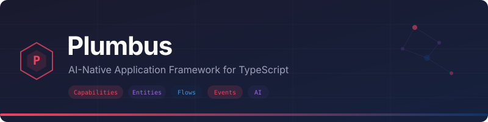

<p align="center">
  
</p>

<h1 align="center">Plumbus</h1>

<p align="center">
  <strong>AI-native, contract-driven TypeScript application framework</strong>
</p>

<p align="center">
  <a href="#quick-start">Quick Start</a> •
  <a href="#core-concepts">Core Concepts</a> •
  <a href="#project-structure">Project Structure</a> •
  <a href="#cli-reference">CLI</a> •
  <a href="#ai-agent-integration">Agent Integration</a> •
  <a href="docs/README.md">Full Documentation</a>
</p>

---

## What is Plumbus?

Plumbus is a **contract-driven, AI-native TypeScript framework** for building modern applications that are safe, auditable, and explainable by default.

Instead of writing loosely organized code, you define your system using six composable primitives:

| Primitive | Purpose | Defined with |
|-----------|---------|--------------|
| **Entity** | Data models with classification and retention | `defineEntity()` |
| **Capability** | Discrete business operations (query, action, job, eventHandler) | `defineCapability()` |
| **Flow** | Multi-step workflows orchestrating capabilities | `defineFlow()` |
| **Event** | Domain facts emitted by capabilities | `defineEvent()` |
| **Prompt** | Structured AI interactions with typed I/O | `definePrompt()` |
| **Translation** | Type-safe i18n message catalogs with ICU MessageFormat | `defineTranslation()` |

The framework provides:

- **Deny-by-default security** — every capability declares an access policy
- **Advisory governance** — warnings (not blockers) for risky patterns
- **Built-in audit trails** — automatic structured logging of all operations
- **Managed AI integration** — cost tracking, output validation, RAG pipelines
- **Compliance profiles** — GDPR, PCI-DSS, SOC2, HIPAA policy assessment
- **Full code generation** — typed API clients, React hooks, Next.js scaffolds

Optional add-on packages extend the core:

- **MCP agent surface** — expose capabilities to AI agents over the Model Context Protocol (`@plumbus/mcp`)
- **Conversational runtime** — `defineChat` with policy guards and context sources (`@plumbus/chat`, plus `@plumbus/chat-ui` for React clients)
- **Realtime voice runtime** — `defineVoice` with transport/STT/TTS providers and session routing (`@plumbus/voice` builtins: websocket / web-speech / browser-tts; optional `@plumbus/voice-*` provider packages for OpenAI, LiveKit, and other vendors)
- **Knowledge sources** — scoped, registry-backed grounding for chat, capabilities, and search UIs (`@plumbus/knowledge-base`)
- **Partner API contracts** — versioned external HTTP surface with OpenAPI, docs, and compatibility diff (`@plumbus/api`)
- **OIDC browser auth** — federated login, opaque server sessions, and CSRF (`@plumbus/auth`, plus `@plumbus/auth-cognito` for Amazon Cognito)

---

## Quick Start

### Prerequisites

- **Node.js** ≥ 20
- **pnpm** ≥ 10
- **PostgreSQL** (for persistence)
- **Redis** (for queues, optional)

### Create a New Application

```bash
# Install the CLI globally
pnpm add -g @plumbus/core

# Scaffold a new project
plumbus create my-app --auth jwt --ai openai --compliance GDPR

# Navigate into your project
cd my-app

# Check environment readiness
plumbus doctor

# Start development server
plumbus dev
```

### Install in an Existing Project

```bash
pnpm add @plumbus/core
```

Zod, Vitest, TypeScript, and other toolchain dependencies are provided by `@plumbus/core` — do not install them separately in consumer apps.

---

## Core Concepts

### Capabilities

Capabilities are the **atomic units of business logic**. Every HTTP route, background job, and event handler is a capability:

```typescript
import { defineCapability } from "@plumbus/core";
import { z } from "@plumbus/core/zod";

export const getUser = defineCapability({
  name: "getUser",
  kind: "query",
  domain: "users",
  description: "Retrieve a user by ID",
  input: z.object({ userId: z.string().uuid() }),
  output: z.object({ id: z.string(), name: z.string(), email: z.string() }),
  access: { roles: ["admin", "user"], scopes: ["users:read"] },
  effects: { data: ["User"], events: [], external: [], ai: false },
  handler: async (ctx, input) => {
    const user = await ctx.data.User.findById(input.userId);
    if (!user) throw ctx.errors.notFound("User not found");
    return user;
  },
});
```

### Entities

Entities define your data models with field-level classification:

```typescript
import { defineEntity, field } from "@plumbus/core";

export const User = defineEntity({
  name: "User",
  description: "Application user",
  tenantScoped: true,
  fields: {
    id: field.id(),
    name: field.string({ classification: "personal" }),
    email: field.string({ classification: "personal", maskedInLogs: true }),
    role: field.enum(["admin", "user", "guest"]),
    createdAt: field.timestamp(),
  },
});
```

### Flows

Flows orchestrate capabilities into multi-step workflows:

```typescript
import { defineFlow } from "@plumbus/core";
import { z } from "@plumbus/core/zod";

export const refundApproval = defineFlow({
  name: "refundApproval",
  domain: "billing",
  description: "Route refund requests through validation and approval",
  input: z.object({ refundId: z.string(), amount: z.number() }),
  trigger: { event: "refund.requested" },
  steps: [
    { name: "validate", type: "capability", capability: "validateRefund" },
    {
      name: "decide",
      type: "conditional",
      if: "ctx.state.amount > 100",
      then: "managerApproval",
      else: "autoApprove",
    },
    { name: "managerApproval", type: "capability", capability: "requestManagerApproval" },
    { name: "autoApprove", type: "capability", capability: "approveRefund" },
    { name: "notify", type: "capability", capability: "sendRefundNotification" },
  ],
  retry: { attempts: 3, backoff: "exponential" },
});
```

### Events

Events represent domain facts:

```typescript
import { defineEvent } from "@plumbus/core";
import { z } from "@plumbus/core/zod";

export const orderPlaced = defineEvent({
  name: "order.placed",
  payload: z.object({ orderId: z.string(), customerId: z.string(), total: z.number() }),
  description: "Emitted when a new order is successfully placed",
});
```

### Prompts

Prompts provide structured AI interactions:

```typescript
import { definePrompt } from "@plumbus/core";
import { z } from "@plumbus/core/zod";

export const classifyTicket = definePrompt({
  name: "classifyTicket",
  description: "Classify support tickets by category, priority, and sentiment",
  system: "You are a support ticket classifier. Analyze the ticket and return structured JSON.",
  input: z.object({ ticketText: z.string() }),
  output: z.object({
    category: z.enum(["billing", "technical", "general"]),
    priority: z.enum(["low", "medium", "high"]),
    sentiment: z.enum(["positive", "neutral", "negative"]),
  }),
  model: { name: "gpt-4o-mini" },
});
```

### Translations

Translations provide type-safe i18n message catalogs with ICU MessageFormat:

```typescript
import { defineTranslation } from "@plumbus/core";

export const commonTranslation = defineTranslation({
  name: "common",
  defaultLocale: "en",
  locales: ["en", "he"],
  messages: {
    en: {
      greeting: "Hello {name}",
      items: "{count, plural, one {# item} other {# items}}",
    },
    he: {
      greeting: "שלום {name}",
      items: "{count, plural, one {פריט #} two {# פריטים} other {# פריטים}}",
    },
  },
});
```

Translation catalogs are validated at import time — all locales must have the same key set. The framework provides a server-side resolver (`ctx.translations.t()`) for backend messages and generates `next-intl` modules for the frontend via `plumbus ui generate`.

### Execution Context

Every capability handler receives `ctx` — the scoped runtime context:

```
ctx.auth       → Authenticated identity (userId, roles, scopes, tenantId)
ctx.data       → Entity repositories (ctx.data.User.findById(id))
ctx.events     → Event emission (ctx.events.emit("order.placed", payload))
ctx.flows      → Flow orchestration (ctx.flows.start("processRefund", input))
ctx.ai         → AI operations (generate, extract, classify, retrieve)
ctx.audit      → Audit logging (ctx.audit.record("user.updated", meta))
ctx.security   → Security helpers (hasRole, hasScope, requireRole, requireScope)
ctx.errors     → Structured errors (validation, notFound, forbidden, conflict)
ctx.logger     → Structured logging (info, warn, error)
ctx.time       → Time utilities (ctx.time.now())
ctx.config     → Read-only application configuration
ctx.translations → Translation resolver (ctx.translations.t("errors.notFound"))
```

---

## Project Structure

```
my-app/
├── app/
│   ├── capabilities/        # Business logic (defineCapability)
│   │   └── billing/
│   │       └── approve-refund/
│   │           ├── capability.ts
│   │           ├── impl.ts
│   │           └── tests/
│   ├── entities/            # Data models (defineEntity)
│   │   └── user.entity.ts
│   ├── flows/               # Workflows (defineFlow)
│   │   └── billing/
│   │       └── refund-approval/
│   │           └── flow.ts
│   ├── events/              # Domain events (defineEvent)
│   │   └── order-placed.event.ts
│   └── prompts/             # AI prompts (definePrompt)
│       └── classify-ticket.prompt.ts
│   └── translations/        # i18n catalogs (defineTranslation)
│       └── common.translation.ts
├── config/
│   ├── app.config.ts        # Framework configuration
│   └── ai.config.ts         # AI provider configuration
├── .plumbus/
│   └── generated/           # Auto-generated (do not edit)
├── .github/
│   └── copilot-instructions.md  # GitHub Copilot wiring
├── AGENTS.md                # Agent context file
└── package.json
```

---

## CLI Reference

```bash
plumbus create <app-name>       # Scaffold a new project
plumbus dev                     # Start development server with hot reload
plumbus doctor                  # Check environment readiness (Node, DB, Redis)
plumbus generate                # Regenerate all artifacts from contracts
plumbus verify                  # Run governance rules
plumbus certify policy <profile>  # Run compliance profile assessment (soc2, gdpr, …)
plumbus migrate generate        # Generate database migration
plumbus migrate apply           # Apply pending migrations
plumbus rag ingest <path>       # Ingest documents into RAG pipeline
plumbus init                    # Generate AI agent wiring files
plumbus agent sync              # Sync project brief for coding agents

# MCP — serve capabilities to AI agents (requires @plumbus/mcp for `serve`)
plumbus mcp serve               # Start an MCP server (stdio / HTTP) for capabilities with exposeAs: ["mcp"]
plumbus mcp generate            # Generate MCP manifest and skill files
plumbus mcp list-tools          # List MCP-exposed tools from the current app contracts

# Translation management
plumbus translation new <name>  # Scaffold a new translation catalog
plumbus translation export      # Export translations for translators (JSON/XLIFF)
plumbus translation import      # Import translated files back
plumbus translation status      # Report translation coverage per locale
```

### `plumbus create`

```bash
plumbus create my-app \
  --database postgresql \
  --auth jwt \
  --ai openai \
  --compliance "GDPR,PCI-DSS" \
  --git                         # Initialize git repo (opt-in)
```

### `plumbus init`

Generates configuration files that help AI coding agents understand your project:

```bash
plumbus init --agent copilot    # GitHub Copilot instructions
plumbus init --agent cursor     # Cursor rules
plumbus init --agent agents-md  # AGENTS.md
plumbus init --agent all        # All formats (default)
```

---

## AI Agent Integration

Plumbus is designed to work seamlessly with AI coding agents (GitHub Copilot, Cursor, Cline, Windsurf, etc.).

### How Agents Discover Framework Knowledge

The framework ships agent instruction files inside npm packages. Start with the index files — they link every topic file and stay current as new instructions are added:

- [`@plumbus/core` instructions index](packages/plumbus-core/instructions/README.md) (`node_modules/@plumbus/core/instructions/README.md`)
- [`@plumbus/ui` instruction files](packages/ui/README.md#instruction-files) (`node_modules/@plumbus/ui/instructions/`)

### Non-Negotiable Guardrails

Generated agent wiring is expected to tell models that:

- business logic belongs in Plumbus primitives, not ad hoc service layers or raw routes
- `ctx.*` subsystems should be used instead of bypassing the framework with custom infrastructure code
- destructive git commands require explicit user approval before execution

If an agent starts implementing around the framework, rerun `plumbus init --patch` after upgrading and verify the generated instruction file still contains the guardrails section.

### Wiring Agents to Your Project

```bash
# Generate all agent configuration files
plumbus init --agent all

# Refresh Plumbus-managed sections without replacing surrounding notes
plumbus init --patch

# Replace existing generated wiring files outright
plumbus init --force

# This creates:
# .github/copilot-instructions.md  — Points Copilot to framework docs
# .cursor/rules/plumbus.mdc        — Cursor rules with SDK references
# AGENTS.md                        — Universal agent context
# .plumbus/briefs/project.md       — Project-specific brief
```

`plumbus init` is non-destructive by default: it creates missing wiring files and skips existing ones. Use `--patch` to update Plumbus-managed blocks in generated files, and use `--force` only when you want a full replacement.

### Manual Agent Setup

If you're configuring an agent manually, point it to the instruction indexes above (read `guardrails.md` first, then follow links from the README).

For a fuller explanation of the framework-first policy and destructive git safety, see [docs/agents/guardrails.md](docs/agents/guardrails.md).

---

## Packages

| Package | Description |
|---------|-------------|
| [`@plumbus/core`](packages/plumbus-core/) | Foundation — capabilities, entities, events, flows, prompts, translations, runtime, CLI, audit, governance |
| [`@plumbus/ui`](packages/ui/) | Next.js/React UI — typed API clients, auth helpers, form metadata, scaffolds |
| [`@plumbus/auth`](packages/auth/) | Optional peer `0.6.x` on core — OIDC RP runtime; hosted login, server sessions, CSRF |
| [`@plumbus/auth-cognito`](packages/auth-cognito/) | Optional — Cognito integration for `@plumbus/auth` (peer `0.1.x`) |
| [`@plumbus/api`](packages/api/) | Optional peer `0.1.x` — partner external API; manifest, OpenAPI, docs, compatibility diff, test intent |
| [`@plumbus/mcp`](packages/mcp/) | Optional peer `0.5.x` — MCP runtime; expose capabilities to AI agents over the Model Context Protocol |
| [`@plumbus/chat`](packages/chat/) | Optional peer `0.1.x` — conversational runtime; `defineChat`, policy guards, context sources, streamed events |
| [`@plumbus/chat-ui`](packages/chat-ui/) | Optional — React hooks and `<ChatPanel />` for the `@plumbus/chat` turn protocol (peer of `@plumbus/chat`) |
| [`@plumbus/knowledge-base`](packages/knowledge-base/) | Optional peer of `@plumbus/chat` `0.1.x` — scoped knowledge providers and registry for registry-backed grounding |
| [`@plumbus/voice`](packages/voice/) | Optional `0.4.x` — real-time voice runtime (`defineVoice`, routes, builtins: websocket / web-speech / browser-tts); peer `@plumbus/core` `0.6.x` |
| [`@plumbus/voice-openai`](packages/voice-openai/) | Optional `0.1.x` — OpenAI Whisper / Realtime STT + OpenAI TTS; peer `@plumbus/voice` `0.4.x` |
| [`@plumbus/voice-livekit`](packages/voice-livekit/) | Optional `0.1.x` — LiveKit transport, agent worker, browser session; peer `@plumbus/voice` `0.4.x` |
| [`@plumbus/voice-soniox`](packages/voice-soniox/) | Optional `0.1.x` — Soniox STT adapter; peer `@plumbus/voice` `0.4.x` |
| [`@plumbus/voice-deepdub`](packages/voice-deepdub/) | Optional `0.1.x` — Deepdub TTS adapter; peer `@plumbus/voice` `0.4.x` |
| [`@plumbus/voice-elevenlabs`](packages/voice-elevenlabs/) | Optional `0.1.x` — ElevenLabs TTS adapter; peer `@plumbus/voice` `0.4.x` |
| [`@plumbus/voice-minimax`](packages/voice-minimax/) | Optional `0.1.x` — MiniMax TTS adapter; peer `@plumbus/voice` `0.4.x` |
| [`@plumbus/browser-extension`](packages/browser-extension/) | Optional `0.1.x` — dev-time WXT scaffolder for Chrome/Firefox extensions wired to your capabilities (with `@plumbus/ui`) |

The optional packages are version-locked peer add-ons — install them explicitly only when you need them (see [`docs/README.md`](docs/README.md)).

---

## Development

```bash
# Clone the repository
git clone https://github.com/plumbus-framework/plumbus.git
cd plumbus

# Install dependencies
pnpm install

# Run all tests (2257 tests across 245 files)
pnpm test

# Type check
pnpm typecheck

# Build all packages
pnpm build
```

### Monorepo Structure

```
plumbus/
├── packages/
│   ├── plumbus-core/           # @plumbus/core — core framework package
│   │   ├── src/
│   │   ├── instructions/      # AI agent instructions — see packages/plumbus-core/instructions/README.md
│   │   └── package.json
│   ├── ui/                    # @plumbus/ui — UI generation package
│   │   ├── src/
│   │   ├── instructions/      # AI agent instructions — see packages/ui/instructions/
│   │   └── package.json
│   ├── api/                   # @plumbus/api — optional partner API contract layer
│   ├── auth/                  # @plumbus/auth — optional OIDC session runtime
│   ├── auth-cognito/          # @plumbus/auth-cognito — optional Cognito integration
│   ├── mcp/                   # @plumbus/mcp — optional MCP runtime
│   ├── chat/                  # @plumbus/chat — optional chat primitive
│   ├── chat-ui/               # @plumbus/chat-ui — optional React chat UI
│   ├── voice/                 # @plumbus/voice — optional real-time voice runtime
│   ├── voice-openai/          # @plumbus/voice-openai — OpenAI STT/TTS add-on
│   ├── voice-livekit/         # @plumbus/voice-livekit — LiveKit transport add-on
│   ├── voice-soniox/          # @plumbus/voice-soniox — Soniox STT add-on
│   ├── voice-deepdub/         # @plumbus/voice-deepdub — Deepdub TTS add-on
│   ├── voice-elevenlabs/      # @plumbus/voice-elevenlabs — ElevenLabs TTS add-on
│   ├── voice-minimax/         # @plumbus/voice-minimax — MiniMax TTS add-on
│   ├── knowledge-base/        # @plumbus/knowledge-base — optional knowledge providers
│   └── browser-extension/     # @plumbus/browser-extension — optional extension scaffolder
├── design/                    # Architecture design documents
├── docs/                      # Documentation
├── turbo.json                 # Turborepo configuration
├── pnpm-workspace.yaml        # pnpm workspace definition
└── tsconfig.base.json         # Shared TypeScript configuration
```

---

## Tech Stack

| Layer | Technology |
|-------|-----------|
| Language | TypeScript 5.x (strict, ESM) |
| Runtime | Node.js ≥ 20 |
| HTTP Server | Fastify 5 |
| Database | PostgreSQL via Drizzle ORM |
| Validation | Zod |
| CLI | Commander.js |
| Testing | Vitest |
| i18n | next-intl (frontend) + built-in ICU resolver (backend) |
| Build | Turborepo + pnpm workspaces |
| AI Providers | OpenAI, Anthropic (pluggable) |

---

## Documentation

Comprehensive documentation is available in the [`docs/`](docs/) directory:

- **[Getting Started](docs/getting-started/)** — Installation, first project, tutorial
- **[Architecture](docs/architecture/)** — System design, diagrams, data flow
- **[Core Concepts](docs/core-concepts/)** — Deep dives into each primitive
- **[SDK Reference](docs/sdk-reference/)** — Complete API documentation
- **[CLI Reference](docs/cli/)** — All commands and options
- **[Security](docs/security/)** — Security model, auth, tenant isolation
- **[Auth](docs/auth/)** — OIDC login, server sessions, CSRF (`@plumbus/auth`)
- **[AI Integration](docs/ai/)** — Prompts, RAG, cost tracking, governance
- **[Testing](docs/testing/)** — Test utilities, patterns, examples
- **[UI Package](docs/ui/)** — Client generation, hooks, Next.js scaffolding
- **[Agent Integration](docs/agents/)** — Wiring AI coding agents to your project

---

## License

MIT

