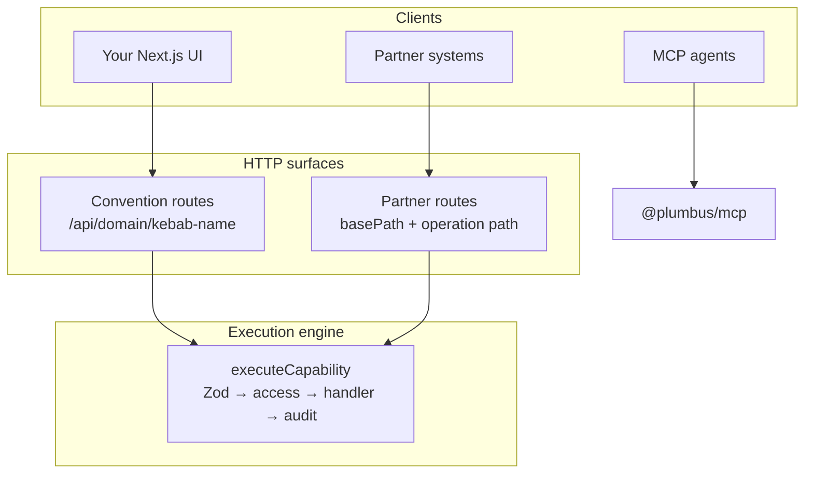
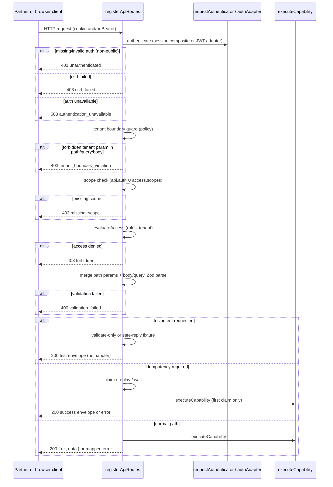

# Partner API (`@plumbus/api`)

**Folder index:** [README.md](./README.md) — navigation, suggested reading paths, and links to agent instructions. This page is the detailed getting-started guide.

The Plumbus framework's partner-facing HTTP contract layer. You mark capabilities with `exposeAs: ['api']`, optionally maintain an `api.yaml` manifest, and serve versioned routes with generated OpenAPI, Markdown docs, compatibility diffing, and safe test-intent fixtures — all backed by the **same Zod schemas, access policies, audit pipeline, and handlers** as your default convention routes.

The runtime lives in [`packages/api`](../../packages/api). CLI commands (`plumbus api validate`, `generate`, `diff`) ship in `@plumbus/core` and dynamically import `@plumbus/api` when installed.

These docs are split in two:

- **Usage** (the files in this folder) — how to expose capabilities, validate contracts, publish OpenAPI, and test partner integrations. Human-readable, explanatory.
- **Agent instructions** — prescriptive recipes for AI coding agents. Lives at [`packages/api/instructions/`](../../packages/api/instructions/) and ships in the npm tarball so agents working in `node_modules/@plumbus/api/` can find it.

Package README (install, exports, CLI quick reference): [`packages/api/README.md`](../../packages/api/README.md).

---

## When to use `@plumbus/api` vs. something else

| You want… | Reach for |
|---|---|
| App-internal routes for your own UI (`/api/{domain}/{kebab-name}`) | Default HTTP runtime in `@plumbus/core` |
| Typed client generation for your Next.js app | [`@plumbus/ui`](../ui/ui-generation.md) |
| Expose a capability to an AI agent over MCP | [`@plumbus/mcp`](../mcp/overview.md) |
| **Versioned, documented partner API with OpenAPI + diff + test fixtures** | **`@plumbus/api`** |

Use the partner API layer when external systems — payment processors, ERP integrations, reseller portals — need a stable, documented HTTP contract. If only your own frontend calls the backend, the default convention routes are enough. If only AI agents need access, use MCP instead.

---

## Mental model

Plumbus capabilities are the source of truth. The partner API layer **projects** them onto custom HTTP paths without duplicating business logic:

1. **Capability contract** — `defineCapability` with Zod `input`/`output`, `access`, `effects`, and `handler`.
2. **Exposure metadata** — `exposeAs: ['api']` plus an `api` block (`operationId`, `method`, `path`, scopes, idempotency, test config).
3. **Optional manifest** — `api.yaml` names a published API product (`basePath`, policy, route overrides).
4. **Runtime adapter** — `registerApiRoutes()` mounts Fastify routes that authenticate, validate, and dispatch to `executeCapability`.
5. **Artifacts** — OpenAPI, Markdown docs, and compatibility diff are generated from the same resolved exposure.

One handler, two HTTP surfaces (convention + partner), one audit log.

---

## Architecture



The partner surface adds contract tooling (manifest, OpenAPI, diff, test intent, idempotency) on top of the same execution engine. It does not replace convention routes unless you choose not to register them.

---

## Install

```bash
pnpm add @plumbus/api
```

`@plumbus/core` works without `@plumbus/api`. Install this package when you want a published partner API. `plumbus api validate` prints an install hint when the package is missing.

Peer dependency: `@plumbus/core` `0.5.x || 0.6.x` (version-locked `0.1.x` for `@plumbus/api`). **Runtime floor:** `@plumbus/api` 0.1.4 requires `@plumbus/core` **≥ 0.6.9** (session auth on partner routes via `buildAuthenticationRequest`). Zod and Vitest are provided transitively by core — do not add them to your app's `package.json` for API work.

Current `plumbus init` wiring already references `@plumbus/api/instructions/*`; installing the package makes those paths resolvable. If your project's agent files predate the current template, refresh them after install:

```bash
plumbus init --patch --agent agents-md   # AGENTS.md only; omit --agent for all formats
plumbus doctor
```

---

## Quick start: first partner API end-to-end

### Step 1 — Mark a capability

```typescript
import { defineCapability } from '@plumbus/core';
import { z } from '@plumbus/core/zod';

export const getRefund = defineCapability({
  name: 'getRefund',
  kind: 'query',
  domain: 'billing',
  description: 'Fetch a refund by id',

  exposeAs: ['api'],
  api: {
    operationId: 'getRefund',
    method: 'GET',
    path: '/refunds/{refundId}',
    stability: 'stable',
    auth: { scopes: ['refunds:read'] },
  },

  input: z.object({ refundId: z.string() }),
  output: z.object({ id: z.string(), amount: z.number() }),
  access: { roles: ['partner'], scopes: ['refunds:read'], tenantScoped: true },
  effects: { data: ['Refund'], events: [], external: [], ai: false },
  handler: async (ctx, { refundId }) => ctx.data.Refund.byId(refundId),
});
```

See [exposure-model](./exposure-model.md) for eligible kinds, metadata fields, and precedence rules.

### Step 2 — (Optional) Add `api.yaml`

```yaml
apiVersion: plumbus.dev/v1
name: partner-api
basePath: /api/v1

expose:
  - capability: billing.getRefund
    operationId: getRefund
    method: GET
    path: /refunds/{refundId}
```

When `./api.yaml` is missing, the CLI and runtime synthesize a manifest from inline `api` metadata. See [manifest](./manifest.md).

### Step 3 — Register partner routes at bootstrap

```typescript
// app/server.ts — export the hook; do not import onRoutesRegistered from @plumbus/core
import { registerApiRoutes } from '@plumbus/api';

export function onRoutesRegistered(app, routeConfig) {
  registerApiRoutes(app, routeConfig, capabilities, {
    manifest,                    // parsed ApiManifest, or omit for inline-only
    appRoot: process.cwd(),      // required for test fixture resolution
  });
}
```

### Step 4 — Validate and publish artifacts

```bash
plumbus api validate
plumbus api generate openapi --out ./dist/openapi.json
plumbus api generate docs --out ./dist/api-docs
plumbus api diff --against ./published/openapi-v1.json   # before release
plumbus api test-fixtures validate                        # if using test intent
```

---

## Request lifecycle

Every partner HTTP request follows a fixed pipeline. Understanding the order helps when debugging 401/403/400 responses.



Key points:

- **Auth first** — missing or invalid credentials on non-public endpoints return `401` before scopes or access are checked. Cookie sessions from `@plumbus/auth` are accepted when `requestAuthenticator` is configured (via `createServer({ authenticationRuntime })`); machine callers continue to use Bearer JWT.
- **Scopes before access** — OAuth-style scope checks run before `evaluateAccess` (roles, tenant).
- **Test intent short-circuits** — when `X-Plumbus-Intent: test` is present and the endpoint supports it, the handler never runs.
- **Idempotency wraps execution** — required idempotency demands an identifiable principal; anonymous callers get `401` before the store is consulted.
- **Same handler** — live requests always reach `executeCapability` with a fresh `ExecutionContext`.

Full details: [exposure-model](./exposure-model.md) (auth, idempotency), [test-intent](./test-intent.md), [structure-policy](./structure-policy.md) (tenant routing).

---

## Surfaces compared

| Surface | Package | Route pattern | Audience |
|---|---|---|---|
| Default REST | `@plumbus/core` | `/api/{domain}/{kebab-name}` | App-internal, generated UIs |
| Partner API | `@plumbus/api` | `{basePath}{operation.path}` | External systems, partners |
| MCP | `@plumbus/mcp` | MCP tools/tasks | AI agents |
| UI clients | `@plumbus/ui` | Generated from convention routes | Human users in browser |

`plumbus generate` still emits a thin `openapi.json` for the convention surface. When `@plumbus/api` is installed, **`plumbus api generate openapi`** is the canonical external contract.

---

## Monorepo relationship

`@plumbus/core` lists `@plumbus/api` as an optional peer and a workspace `devDependency` so framework development can type-check and test the `plumbus api` CLI via dynamic import. Published apps install `@plumbus/api` explicitly. There is no runtime circular dependency — core never imports from api at load time.

---

## Documentation map

| Doc | Read when… |
|---|---|
| [exposure-model.md](./exposure-model.md) | You want to understand `exposeAs`, the `api` metadata block, auth scopes, idempotency, and which capability kinds can be exposed. |
| [manifest.md](./manifest.md) | You are authoring or validating `api.yaml`, or need the field-by-field reference and error catalog. |
| [openapi.md](./openapi.md) | You are generating or publishing OpenAPI, or need to understand servers/paths, security schemes, and envelope components. |
| [test-intent.md](./test-intent.md) | Partners need safe integration testing with fixtures, or you are configuring `validate-only` / `safe-reply` modes. |
| [structure-policy.md](./structure-policy.md) | You need tenant routing rules, GET semantics, or the public+test guard. |
| [compatibility.md](./compatibility.md) | You are diffing API versions in CI or deciding whether a change is breaking. |
| [governance.md](./governance.md) | You want advisory warnings from `plumbus verify` and how they relate to `plumbus api validate`. |

## Agent instructions

Read these when you are an AI agent extending a Plumbus app that publishes a partner API. They live in the package ([`packages/api/instructions/`](../../packages/api/instructions/)):

- [`framework.md`](../../packages/api/instructions/framework.md) — package boundary, exports, critical rules
- [`expose-a-capability.md`](../../packages/api/instructions/expose-a-capability.md) — full exposure recipe
- [`manifest-and-cli.md`](../../packages/api/instructions/manifest-and-cli.md) — manifest, validation, OpenAPI, diff
- [`testing.md`](../../packages/api/instructions/testing.md) — test intent, idempotency, route tests

---

**Next:** [exposure-model.md](./exposure-model.md) — how capabilities become partner HTTP operations.
